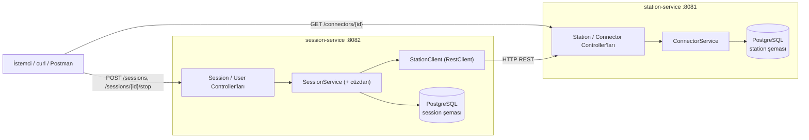

# ChargeSquare — EV Şarj Backend (Case Study)

Bir EV şarj backend'inin uçtan uca çalışan küçük ama eksiksiz bir dilimi: **oturumu başlat → durdur → tarifeye göre fiyatla → cüzdandan tahsil et.** İki servis ve paylaşımlı bir PostgreSQL üzerine kurulu.

## Hızlı başlangıç

```bash
cp .env.example .env && docker compose up -d --build   # Postgres + iki servis
./scripts/demo.sh                                      # tüm akışı koşar ve DOĞRULAR
```

`demo.sh` giriş yapar, oturum başlatır (201), faturalar (**108.25**), cüzdanı (**391.75**) ve connector'ın serbest kaldığını doğrular, guard'ları sınar. Hepsi geçerse çıkış kodu 0'dır. Aynı akışın elle `curl` hâli: [Uçtan uca örnek](#uçtan-uca-örnek).

## Gereksinimler

| Ne için | Gereken |
|---|---|
| **Uygulamayı çalıştırmak** (ana yol) | **Yalnızca Docker + Compose.** Java/Maven kurmaya gerek yok — derleme konteynerin içinde JDK 21 ile yapılır. |
| Testleri lokalde koşmak | **JDK 21** (Maven gerekmez; `./mvnw` kendi indirir). Daha yeni JDK'lar Mockito nedeniyle çalışmaz — bkz. [Testler](#testler). |
| Paneli çalıştırmak | **Node 18+** — bkz. [Panel](#panel-web). |

---

## Mimari

Sorumlulukları net ayrılmış iki servis. Session Service, başlatma ve durdurma sırasında Station Service'e **gerçek bir senkron REST çağrısı** yapar.



- **Station Service** — istasyonların, connector'ların (EVSE) ve tarifelerin tek doğruluk kaynağı. Connector durumunu (`AVAILABLE` / `OCCUPIED`) o tutar.
- **Session Service** — şarj oturumunun yaşam döngüsünü yönetir. Başlangıçta tarifenin bir kopyasını (snapshot) alır, durdurmada maliyeti hesaplar ve cüzdandan tahsil eder. Cüzdan, ayrı bir servis yerine bu servisin içinde bir modül olarak durur.

Diğer diyagramlar (başlatma / durdurma akışları, durum makineleri, hata akışı): [`diagrams/`](diagrams/).

---

## Teknoloji

| | |
|---|---|
| Dil / framework | **Java 21 · Spring Boot 3.3.5** |
| Veritabanı | **PostgreSQL 16** (tek paylaşımlı veritabanı, servis başına bir şema) |
| Migration | Flyway (şema sıfırdan kurulur, `ddl-auto: validate`) |
| Para | `BigDecimal` + `NUMERIC(12,2)`, 2 basamağa `HALF_UP` yuvarlama |
| Altyapı | Docker Compose · Kubernetes manifestleri · GitHub Actions CI |

Spring Boot'u **ilk kez** bu projede kullandım; ChargeSquare'in ana stack'i olduğu için bilinçli seçtim ve süreçte öğrenmeyi hedefledim. Kararları framework'ün kolaylıklarına değil, temiz kod ve katmanlı mimari ilkelerine (domain modeli, ince controller, izole persistence) dayandırdım. Tüm kararların gerekçeleri için: [DESIGN.md](DESIGN.md).

---

## Çalıştırma

Tek komut [Hızlı başlangıç](#hızlı-başlangıç)'ta. Ayağa kalkınca kullanılan adresler:

| Servis | Adres |
|---|---|
| station-service | `localhost:8081` |
| session-service | `localhost:8082` |
| PostgreSQL | `localhost:5432` |
| Panel (ayrıca başlatılır) | `localhost:5173` |

Hazır olduğunu doğrulamak için:

```bash
curl localhost:8081/health    # {"status":"UP", ...}
curl localhost:8082/health
```

Logları önplanda izlemek isterseniz `-d` olmadan çalıştırın: `docker compose up --build`.
`.env` sürüm kontrolüne girmez; tüm ayarlar oradan okunur (bkz. [Konfigürasyon](#konfigürasyon)).

---

## Uçtan uca örnek

Başlangıç verisi: `10` numaralı connector `AVAILABLE`, tarife `8.50 TRY/kWh + 2.00` başlangıç ücreti, `7` numaralı kullanıcının bakiyesi `500.00`.

**En hızlı yol — tüm akışı tek komutla doğrulayın:**

```bash
./scripts/demo.sh
```

Bu script giriş yapar, connector'ın boş olduğunu görür, oturum başlatır (201), connector'ın dolduğunu doğrular, durdurup faturalar (**108.25**), cüzdanı kontrol eder (**391.75**), connector'ın serbest kaldığını görür ve guard'ları sınar (ikinci durdurma 409, bilinmeyen connector 404, eksik alan 400, token'sız 401, viewer 403). Beklenen değerleri **doğrular**; bir şey tutmazsa çıkış kodu sıfır değildir.

Aşağıdaki adımlar aynı akışı elle gösterir. Uçlar korumalıdır (bkz. [Kimlik doğrulama](#kimlik-doğrulama)), o yüzden önce giriş yapıp token'ı isteklere ekliyoruz.

```bash
# 0) GİRİŞ — admin olarak token al
TOKEN=$(curl -s -X POST localhost:8082/auth/login \
  -H 'Content-Type: application/json' \
  -d '{"username":"admin","password":"admin123"}' | sed -E 's/.*"token":"([^"]+)".*/\1/')

# 1) BAŞLAT — 201 döner, connector OCCUPIED olur, tarifenin kopyası alınır.
#    Oturum id'sini yakalıyoruz; böylece adımlar kaçıncı oturum olursa olsun çalışır.
SESSION_ID=$(curl -s -X POST localhost:8082/sessions \
  -H "Authorization: Bearer $TOKEN" -H 'Content-Type: application/json' \
  -d '{"userId":7,"connectorId":10}' | sed -E 's/.*"sessionId":([0-9]+).*/\1/')
echo "oturum: $SESSION_ID"

# 2) HATALI DURUM — connector şimdi dolu; aynı connector'a başlatma 409 döner, oturum yaratılmaz
curl -X POST localhost:8082/sessions \
  -H "Authorization: Bearer $TOKEN" -H 'Content-Type: application/json' \
  -d '{"userId":7,"connectorId":10}'

# 3) DURDUR — maliyet = 12.5 × 8.50 + 2.00 = 108.25
#    (temiz bir stack'te cüzdan 500.00 -> 391.75; daha önce oturum koştuysan bakiye daha düşük olur)
curl -X POST localhost:8082/sessions/$SESSION_ID/stop \
  -H "Authorization: Bearer $TOKEN" -H 'Content-Type: application/json' \
  -d '{"energyKwh":12.5}'

# 4) Makbuzu geri oku — COMPLETED; connector yeniden AVAILABLE olur
curl localhost:8082/sessions/$SESSION_ID -H "Authorization: Bearer $TOKEN"
curl localhost:8081/connectors/10 -H "Authorization: Bearer $TOKEN"
```

Bütün hatalar aynı gövde biçimini kullanır: `{ "error": "KOD", "message": "..." }`.

---

**Station Service** (`:8081`)

| Metot | Yol | Erişim | Açıklama |
|---|---|---|---|
| GET | `/connectors/{id}` | VIEWER/ADMIN | Connector durumu + tarife (bilinmiyorsa 404) |
| GET | `/stations/{id}/connectors` | VIEWER/ADMIN | Bir istasyonun connector'ları |
| POST | `/connectors/{id}/occupy` | ADMIN | OCCUPIED yap (zaten doluysa 409) — dahili |
| POST | `/connectors/{id}/release` | ADMIN | AVAILABLE yap (idempotent) — dahili |

**Session Service** (`:8082`)

| Metot | Yol | Erişim | Açıklama |
|---|---|---|---|
| POST | `/auth/login` | açık | Kullanıcı adı+şifre → JWT + rol |
| POST | `/sessions` | ADMIN | BAŞLAT — 201; 404/409/400 durumunda oturum yaratılmaz |
| POST | `/sessions/{id}/stop` | ADMIN | DURDUR + FATURALA + TAHSİL ET — 200 makbuz |
| GET | `/sessions/{id}` | VIEWER/ADMIN | Tek bir oturumu oku |
| GET | `/users/{userId}/sessions` | VIEWER/ADMIN | Bir kullanıcının oturumları |

`/health` uçları herkese açıktır. Durum kodları: `401` token yok/geçersiz · `403` yetersiz rol · `404` bilinmeyen connector/oturum · `409` dolu connector / aktif olmayan (veya ikinci kez) durdurma · `400` geçersiz istek · `503` Station Service'e ulaşılamıyor.

---

## Kimlik doğrulama

Basit bir JWT tabanlı erişim kontrolü (Stage 2, backend tarafı **implement edildi**). `POST /auth/login` geçerli kimlik bilgisinde rol taşıyan bir JWT üretir; token `Authorization: Bearer <token>` ile taşınır ve her iki serviste de doğrulanır.

**Demo kullanıcılar** (şifreler yalnızca demo amaçlıdır):

| Kullanıcı | Şifre | Rol | Yetki |
|---|---|---|---|
| `admin` | `admin123` | ADMIN | okuma + başlat/durdur + dahili occupy/release |
| `viewer` | `viewer123` | VIEWER | yalnızca okuma |

- **Roller sunucuda zorunlu kılınır** (buton gizleyerek değil): token yoksa `401`, yetki yetmezse `403`.
- **Servisler arası:** internal `occupy`/`release` de ADMIN ister; Session Service, Station'a çağrılarında kendi ürettiği bir ADMIN servis token'ı taşır.
- JWT imzalama anahtarı `JWT_SECRET` ortam değişkeninden gelir (iki servis paylaşır), depoya konmaz.

Tam güvenlik modeli ve gerekçeler için [DESIGN.md](DESIGN.md#güvenlik).

---

## Testler

```bash
# Maven kurulu olmasına gerek yok (wrapper kendi indirir); JDK 21 gerekir — aşağıdaki nota bakın.
(cd station-service && ./mvnw test)
(cd session-service && ./mvnw test)
```

21 test var: maliyet hesabı (örnek: `108.25`, artı yuvarlama durumları), başlat→durdur yaşam döngüsü (connector'ın serbest bırakıldığı dahil), tarife zamlansa bile oturumun kendi snapshot'ıyla faturalandığı, hatalı istekler (dolu connector'a başlatma 409, ikinci durdurma 409 + **cüzdanın tekrar düşülmediği**, eksik alan 400, bilinmeyen kayıt 404) ve kimlik doğrulama/yetki (login, token yok → 401, yetersiz rol → 403).

- Testler **gömülü ama gerçek bir PostgreSQL** (zonky) üzerinde koşar; yani `mvn test` için **Docker gerekmez.** Migration'lar üretimdekiyle birebir aynı çalışır.
- Testleri koşmak için **JDK 21 şarttır:** Mockito'nun kullandığı byte-code kütüphanesi daha yeni JDK sürümlerini desteklemiyor. Docker/Compose yolu bundan etkilenmez (içeride zaten 21 ile derler). CI de JDK 21'e sabitlenmiştir.

---

## Konfigürasyon

Tüm ayarlar ortam değişkenlerinden gelir; hiçbir şey koda gömülü değil, hiçbir secret depoya konmadı. Tam liste için [`.env.example`](.env.example) (veritabanı URL'i ve kimlik bilgileri, servis portları, `STATION_SERVICE_URL`, JWT imzalama anahtarı `JWT_SECRET`).

---

## Kubernetes

[`k8s/`](k8s/) altında sade manifestler var: bir `ConfigMap` ve `Secret`, bir Postgres `Deployment`/`Service`, ayrıca her servis için `/health` uçlarına bağlı readiness/liveness kontrolü olan birer `Deployment` + `Service`.

Manifestlerin tam doğrulaması çalışan bir cluster ister:

```bash
kubectl apply --dry-run=client -f k8s/
```

Bunu canlı bir cluster üzerinde çalıştıramadım; manifestleri geçerli YAML olarak ve beklenen kaynak türleriyle doğruladım. `Secret` DB kimlik bilgilerini ve JWT imzalama anahtarını tutar; değerler örnek (placeholder) değerlerdir — gerçek bir kurulumda bir secret yöneticisinden gelir, asla depodan değil.

---

## Varsayımlar

- **Enerji miktarını durdurma isteğinde istemci bildirir** (`energyKwh`); sayaç simüle edilmiştir, case metni buna izin veriyor.
- **Bakiye yetmezse tahsilata izin verilir ve cüzdan eksiye düşebilir.** Enerji zaten verildiği için durdurmayı reddetmek doğru olmaz; faturayı keser, bakiyenin sıfırın altına inmesine izin verir ve connector'ı yine serbest bırakırız. (Üretimde bunu ön provizyon + canlı sayaçla nasıl önlerdim ve neden negatif bakiye yine de gerekir: [DESIGN.md](DESIGN.md#yetersiz-bakiye--neden-durdurmayı-reddetmiyoruz))
- **`/release` idempotenttir:** zaten boşta olan bir connector'ı bırakmak bir şeyi bozmaz, böylece durdurma akışı bu adımda takılmaz.
- **Oturum süresi maliyeti etkilemez:** maliyet yalnızca `enerji × fiyat + başlangıç ücreti`; zaman bilgileri sadece makbuz içindir.
- **Tek paylaşımlı veritabanı, servis başına bir şema:** ikinci bir veritabanı kurmadan temiz bir sahiplik sınırı sağlar.
- **Başlatma; connector'ı (Station üzerinden) ve cüzdanı doğrular, kullanıcı kaydını ayrıca doğrulamaz** — case metnindeki başlatma kurallarıyla uyumlu (bilinmeyen connector 404, dolu 409, geçersiz istek 400).

---

## Ne kodlandı, ne yalnızca yazıya döküldü

**Kodlandı:** tüm başlat → durdur → faturala → tahsil et akışı, bütün durum kontrolleri, kayan noktadan kaçınan maliyet hesabı, gerçek Session → Station ağ çağrısı, gerçek veritabanı kalıcılığı + başlangıç verisi, JWT tabanlı kimlik doğrulama + rol tabanlı erişim (Stage 2 backend), React yönetim paneli (Stage 2 frontend), testler, Dockerfile'lar + Compose, Kubernetes manifestleri ve CI.

**Yalnızca yazıya döküldü** ([DESIGN.md](DESIGN.md) içinde — case metninin bizden *çözmemizi değil, üzerine düşünüp anlatmamızı* istediği asıl zor dağıtık sistem konuları): tekrar denemelerde idempotency ve kilitli kalan connector'ın kurtarılması.

## Opsiyonel / Stage 2

Stage 2'nin **tamamı yapıldı** — hem backend güvenliği hem de yönetim paneli:
- **Backend:** JWT login, VIEWER/ADMIN rolleri backend'de zorunlu, korumalı uçlar, servisler arası ADMIN service token ve config tabanlı CORS (yukarıdaki [Kimlik doğrulama](#kimlik-doğrulama)).
- **Panel:** [`web/`](web/) altında küçük bir React (Vite) paneli — aşağıdaki [Panel](#panel-web) bölümü.

Tam güvenlik modeli, roller, secret yönetimi ve denetim (audit) log planı [DESIGN.md](DESIGN.md)'in **Güvenlik** bölümündedir.

---

## Panel (web)

Operasyon ekibi için sade bir React paneli — 4 ekran, abartısız. Backend çalışırken:

```bash
cd web
npm install
npm run dev            # http://localhost:5173
```

- **Login** — demo kullanıcılarla giriş (bkz. [Kimlik doğrulama](#kimlik-doğrulama)).
- **Connector'lar** — istasyonun connector'ları: durum + tarife (salt-okunur).
- **Oturumlar** — oturum listesi (durum + maliyet); satıra tıkla → makbuz (enerji, maliyet, zaman, kalan bakiye).
- **Rol-korumalı aksiyon** — ADMIN aktif bir oturumu durdurabilir; VIEWER'da buton **pasiftir**. Yetki hem arayüzde hem backend'de (403) zorlanır.

Panelin backend adresleri `web/.env.example`'daki `VITE_STATION_URL` / `VITE_SESSION_URL` ile ayarlanır (varsayılan `localhost:8081` / `8082`).

---

## Harcanan zaman / sırada ne olurdu

- **Zaman:** aşağı yukarı hedeflenen Stage 1 aralığı; odağım çekirdek akışı doğru ve iyi test edilmiş hâle getirmekti.
- **Daha fazla zaman olsa:** idempotent durdurmayı gerçekten kodlardım (idempotency anahtarı ile), cüzdana yükleme (top-up) ucu eklerdim, ikinci bir temiz sınır olarak bir `SessionCompleted` olayı bağlardım ve çalışan bir Station Service'e karşı başlat→durdur akışını sınayan bir servisler arası entegrasyon testi yazardım.

## Repo yapısı

```
station-service/   # istasyonlar, connector'lar, tarifeler (:8081)
session-service/   # oturumlar, cüzdan, başlat/durdur yaşam döngüsü (:8082)
web/               # React (Vite) operasyon paneli (:5173)
scripts/demo.sh    # uçtan uca smoke test (beklenen değerleri doğrular)
k8s/               # Kubernetes manifestleri
diagrams/          # Mermaid diyagramları (mimari + akışlar)
docker-compose.yml # tek komutla yerel çalıştırma
DESIGN.md          # kararlar, muhakeme yazıları, güvenlik tasarımı
```
