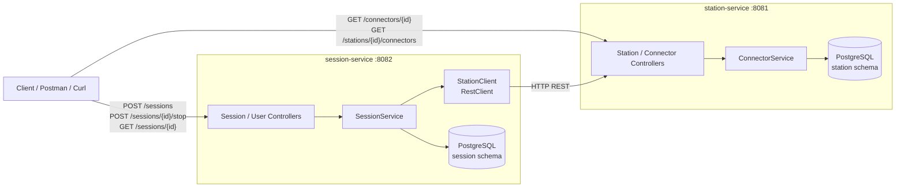
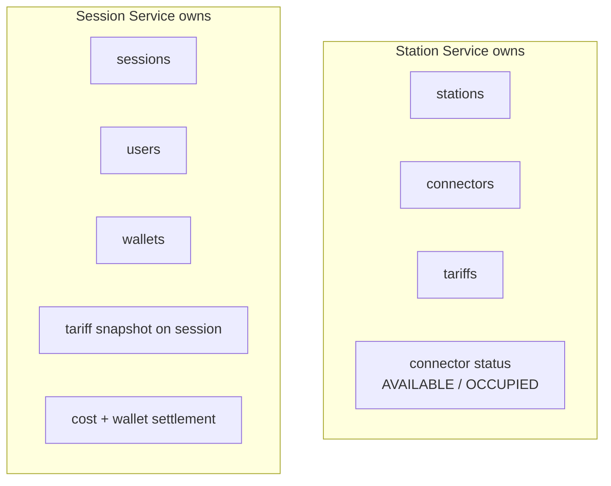

# Genel Mimari

## Servisler ve İletişim

```mermaid
flowchart LR
    Client["Client / Postman / Curl"]

    subgraph Station["station-service :8081"]
        StationController["Station / Connector Controllers"]
        ConnectorService["ConnectorService"]
        StationDB[("PostgreSQL\nstation schema")]
    end

    subgraph Session["session-service :8082"]
        SessionController["Session / User Controllers"]
        SessionService["SessionService"]
        StationClient["StationClient\nRestClient"]
        SessionDB[("PostgreSQL\nsession schema")]
    end

    Client -->|"GET /connectors/{id}\nGET /stations/{id}/connectors"| StationController
    Client -->|"POST /sessions\nPOST /sessions/{id}/stop\nGET /sessions/{id}"| SessionController

    StationController --> ConnectorService
    ConnectorService --> StationDB

    SessionController --> SessionService
    SessionService --> SessionDB
    SessionService --> StationClient
    StationClient -->|"HTTP REST"| StationController
```

## Data Ownership

```mermaid
flowchart TB
    subgraph StationService["Station Service owns"]
        Stations["stations"]
        Connectors["connectors"]
        Tariffs["tariffs"]
        ConnectorStatus["connector status\nAVAILABLE / OCCUPIED"]
    end

    subgraph SessionService["Session Service owns"]
        Sessions["sessions"]
        Users["users"]
        Wallets["wallets"]
        TariffSnapshot["tariff snapshot on session"]
        Settlement["cost + wallet settlement"]
    end
```

