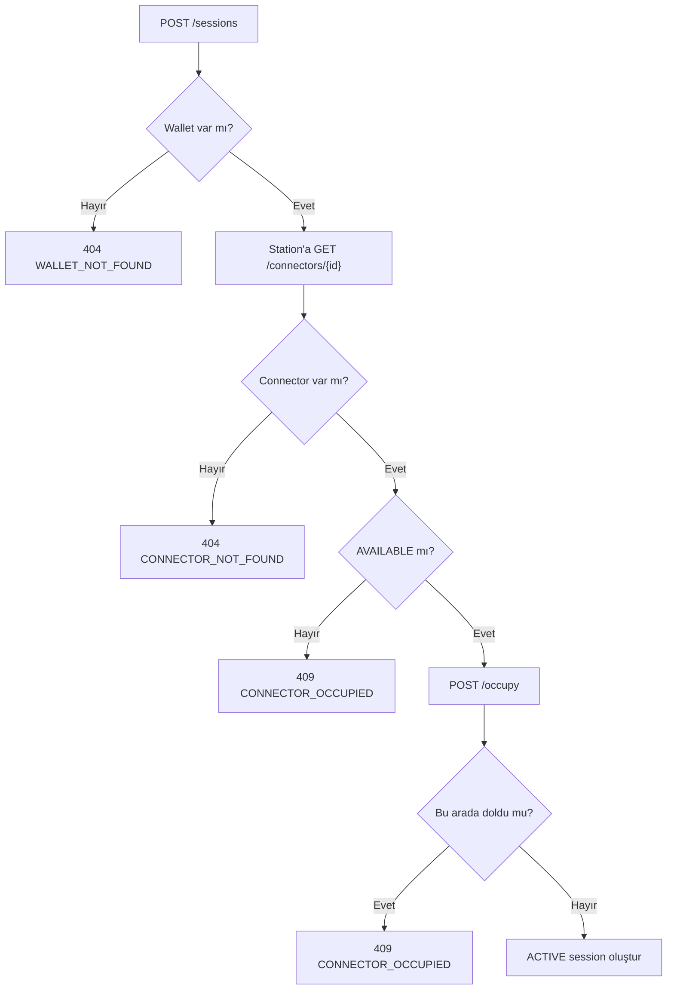

# START Hata Akışı

```mermaid
flowchart TD
    Start["POST /sessions"] --> WalletCheck{"Wallet var mı?"}
    WalletCheck -->|Hayır| Wallet404["404 WALLET_NOT_FOUND"]
    WalletCheck -->|Evet| ConnectorCheck["Station'a GET /connectors/{id}"]

    ConnectorCheck --> ConnectorExists{"Connector var mı?"}
    ConnectorExists -->|Hayır| Connector404["404 CONNECTOR_NOT_FOUND"]
    ConnectorExists -->|Evet| Available{"AVAILABLE mı?"}

    Available -->|Hayır| Conflict409["409 CONNECTOR_OCCUPIED"]
    Available -->|Evet| Occupy["POST /occupy"]

    Occupy --> Race{"Bu arada doldu mu?"}
    Race -->|Evet| Race409["409 CONNECTOR_OCCUPIED"]
    Race -->|Hayır| CreateSession["ACTIVE session oluştur"]
```

Not: İki kişi aynı anda aynı connector'a start basarsa Station tarafındaki lock ve `occupy()` guard yüzünden sadece biri başarılı olur.

