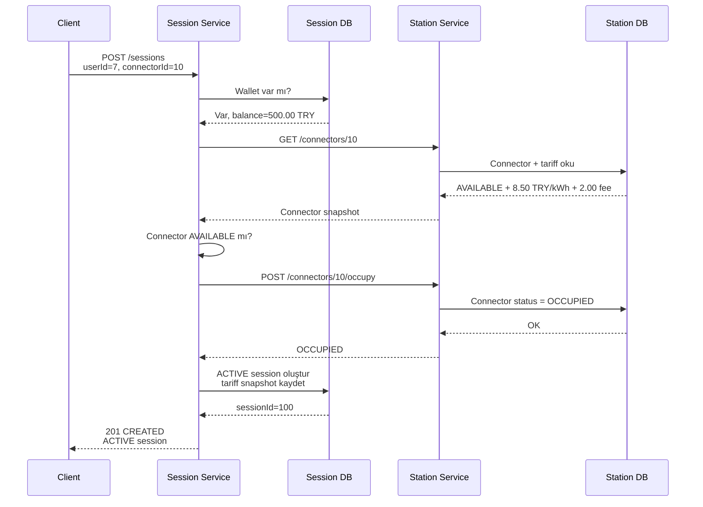

# START Akışı

Request:

```http
POST /sessions
Content-Type: application/json

{
  "userId": 7,
  "connectorId": 10
}
```

Sequence:



Kritik fikir: Session başlamadan önce Station Service'e gerçekten sorulur. Connector müsait değilse session yaratılmaz.

