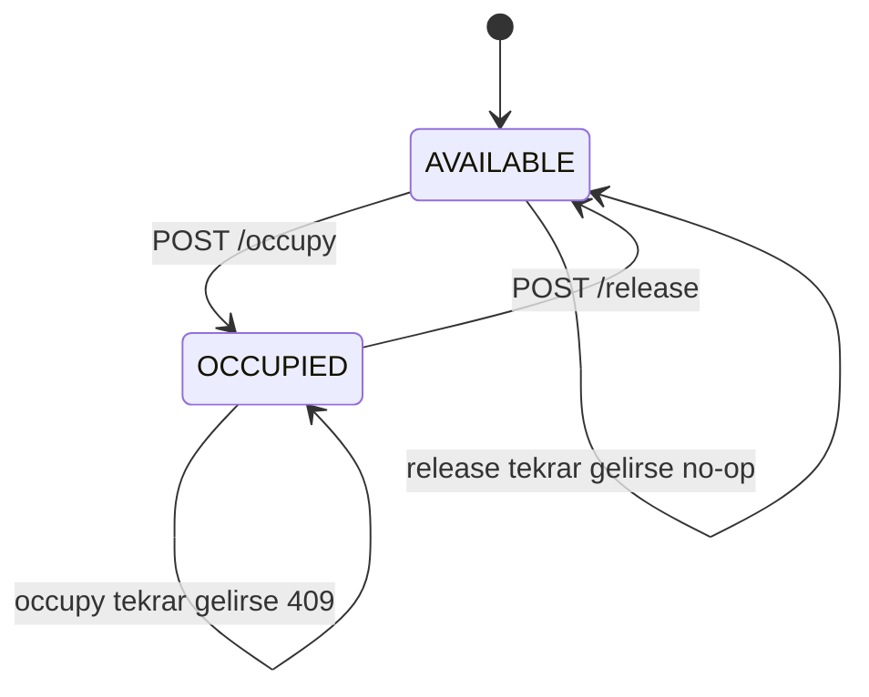
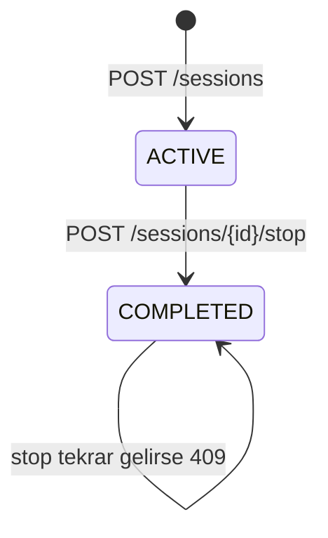

# State Machine'ler

## Connector State Machine



## Session State Machine



Ana doğruluk kuralları:

```text
Dolu connector'a start olmaz.
Bitmiş session tekrar stop edilemez.
Stop olunca connector boşa çıkar.
```

