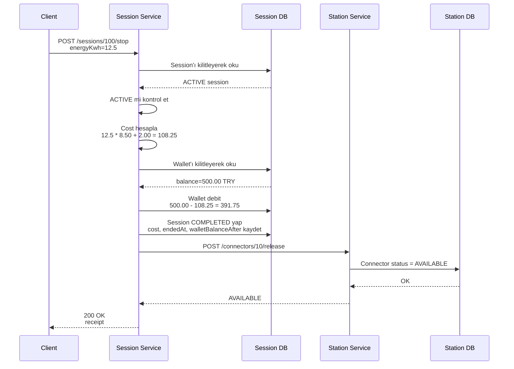

# STOP / BILL / SETTLE Akışı

Request:

```http
POST /sessions/100/stop
Content-Type: application/json

{
  "energyKwh": 12.5
}
```

Sequence:



Beklenen sonuç:

```text
Session status = COMPLETED
Connector status = AVAILABLE
Wallet balance = 391.75
Cost = 108.25
```

